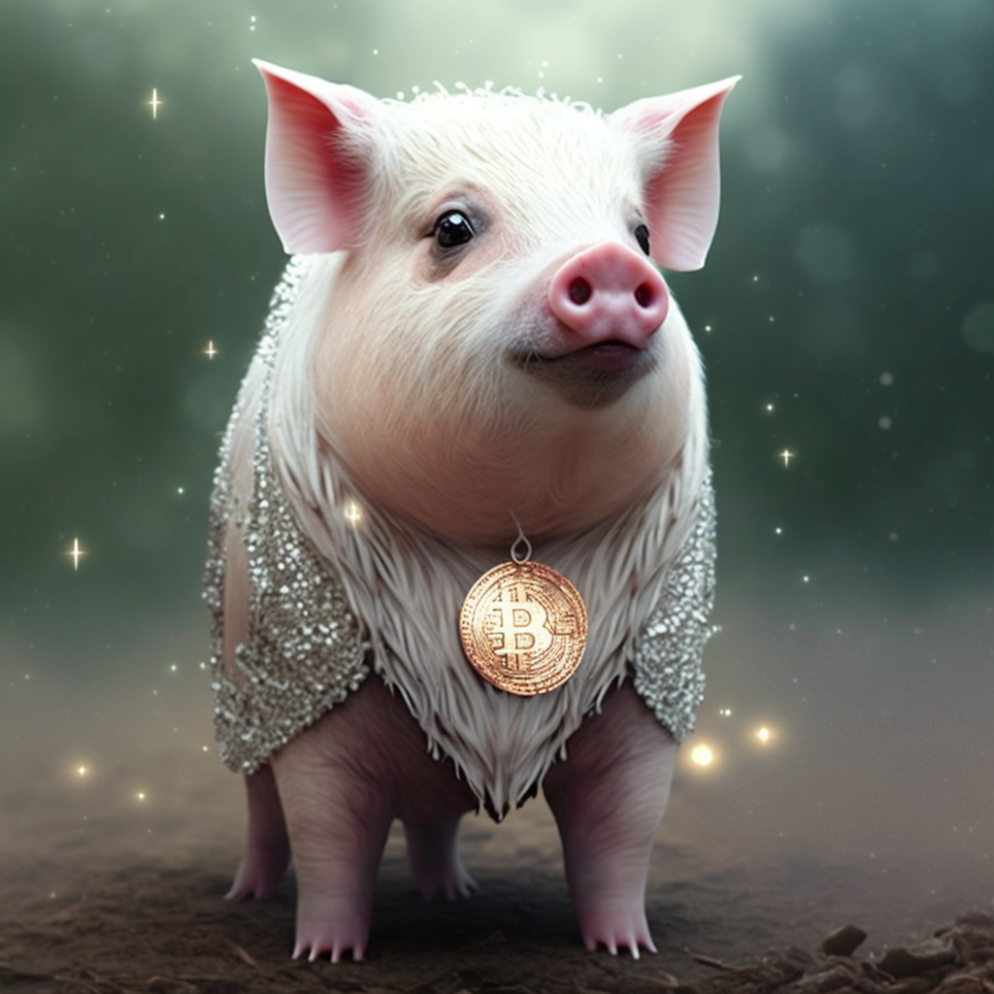

# 🐽 NFT PIGINU

🐷NFT Staking in PIGINU is a way of staking or locking coins in exchange for rewards in the form of non-fungible tokens (NFTs) and receiving higher APY rewards at the end of a 90-day period compared to regular staking. Although it requires a higher investment, as holders need to acquire a PIGINU NFT, it provides greater profitability in a shorter time period and opportunities for community interaction.

#### There are several benefits to participating in NFT Staking in PIGINU, including:

* [x] Acquisition of exclusive NFT tokens: PIGINU holders can acquire unique NFT tokens as rewards for participating in staking. These tokens may have intrinsic value and can be used in different applications (such as having higher APY for profitability).
* [x] Community strengthening: NFT Staking can help strengthen the PIGINU community by encouraging active participation and engagement from coin holders.
* [x] Reduction of price volatility: by locking coins in exchange for NFT tokens, coin holders may be less likely to sell their coins in the short term, which can help reduce price volatility.
* [x] Incentives to hold coins instead of trading them: PIGINU NFT Staking provides token holders with a financial incentive to keep their coins locked up instead of selling them in the short term, which can help reduce selling pressure on the coin's price.

<figure><figcaption>
PIGINU 
</figcaption></figure>

 

<figure><figcaption>
PIGINU
</figcaption></figure>

 

<figure><figcaption>
PIGINU
</figcaption></figure>

* The PIGINU NFT\`s have APY according to their values, which can vary from 110% to 210%.

| Classification  |  APY |
| --------------- | :--: |
| PIGINU 0,05 ETH | 110% |
| PIGINU 0,06 ETH | 130% |
| PIGINU 0,08 ETH | 180% |
| PIGINU 0,1 ETH  | 210% |

<figure><figcaption>
COIN PIGINU MYSTERY
</figcaption></figure>

 

<figure><figcaption>
COIN PIGINU MYSTERY
</figcaption></figure>

 

<figure><figcaption>
COIN PIGINU MYSTERY
</figcaption></figure>

* The NFT\`S COIN PIGINU MYSTERY will have its values revealed in the act of inclusion for the staking, with that it can vary in the table above, but it always reserves great rewards!
